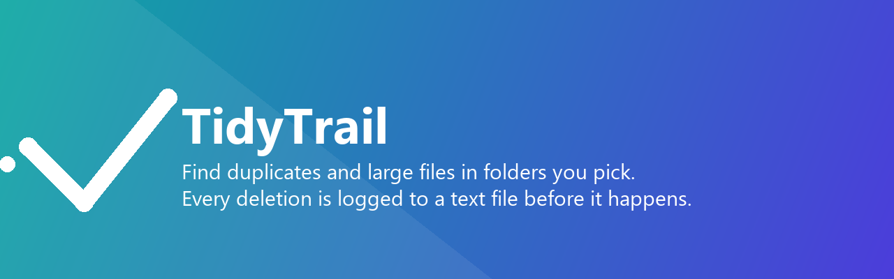

<p align="center">
  
</p>

<p align="center">
  <a href="https://github.com/sunilgentyala/TidyTrail/actions/workflows/ci.yml"></a>
  
  
  <a href="LICENSE"></a>
  
</p>

<p align="center"><b>sunilgentyala.github.io/TidyTrail</b></p>

An iOS storage organizer that finds duplicate and large files in folders you
choose, and writes a plain-text log of exactly what it deleted - before it
deletes anything.

## What this app actually does (and doesn't)

iOS sandboxes every third-party app. There is no API that lets an app scan
"the whole phone," clear another app's cache, or sweep OS-level temp files -
Apple rejects apps that claim to (App Store Review Guideline 2.3.1, deceptive
functionality). So TidyTrail is scoped to what's actually possible and honest:

| | |
|---|---|
| **Pick a folder** | Grant access to one folder via the standard Files picker (`UIDocumentPickerViewController`) - e.g. an "On My iPhone" folder, or an iCloud Drive folder. |
| **Scan it** | Recursively finds exact duplicate files (by content hash, not just name/size) and the largest files in that folder. |
| **Delete with a log** | Before anything is removed, writes a text manifest to `Files > On My iPhone > TidyTrail Logs`, then deletes, then rewrites that same log with the real outcome (`DELETED` or `FAILED: <reason>`) for every item. |
| **Storage tab** | Shows device-wide total/available capacity (public API), for context only - it does not and cannot claim to break that down by app. |

Nothing here touches another app's data or the OS's own caches, because iOS
does not allow that.

## Architecture

- **`Sources/TidyTrailCore`** - a pure-Swift package (Foundation + CryptoKit
  only, no UIKit) with the scanning, duplicate-detection, and delete-then-log
  logic. Covered by real XCTest unit tests in `Tests/TidyTrailCoreTests`.
- **`Sources/TidyTrail`** - the SwiftUI app target (views, view models, UIKit
  document-picker bridge).
- **`project.yml`** - an [XcodeGen](https://github.com/yonaskolb/XcodeGen)
  spec. The `.xcodeproj` itself is generated, not committed; `project.yml` is
  the source of truth so the project stays diffable and editable outside Xcode.
- **`.github/workflows/ci.yml`** - runs `swift test` and a full simulator
  build on every push, on a macOS GitHub Actions runner (this repo is
  developed from a Windows machine with no local Xcode - CI is the real
  build/test loop).
- **`.github/workflows/release.yml`** - manual-dispatch workflow that builds,
  signs, and uploads a build to TestFlight via fastlane. Requires a one-time
  Apple signing setup - see [`docs/APP_STORE_SUBMISSION.md`](docs/APP_STORE_SUBMISSION.md).

## Building locally (requires macOS + Xcode)

```bash
brew install xcodegen
xcodegen generate
open TidyTrail.xcodeproj
```

## Running just the core logic tests (macOS, no simulator needed)

```bash
swift test
```

## Status

In development, pre-release. Not yet on the App Store. See:

- [`docs/APP_STORE_SUBMISSION.md`](docs/APP_STORE_SUBMISSION.md) - remaining
  manual steps to publish (App Store Connect listing, signing credentials,
  screenshots, privacy details).
- [`docs/INSTALLATION.md`](docs/INSTALLATION.md) - how to install a build
  today (Xcode/simulator, TestFlight) and how end users will install it once
  published.

## License

MIT - see [LICENSE](LICENSE).
